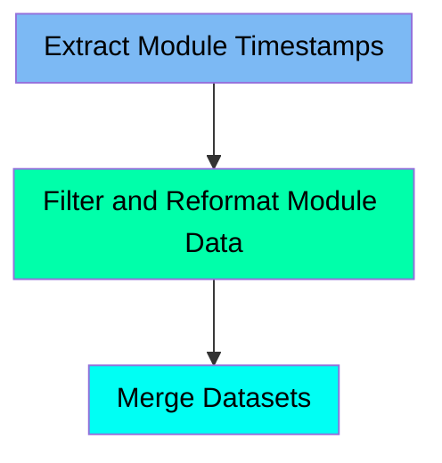

The TIMESTAMP job (TIMESTAMP) is used to generate a list of module timestamps from the AMBLIST output. This process involves running the AMBLIST program to extract module names and timestamps, filtering and reformatting the data, and finally merging the datasets to produce a comprehensive list. The input for this job is the load module library, and the output is a dataset containing the module names and their corresponding timestamps.

For instance, if the load module library contains several modules, the TIMESTAMP job will extract the names and timestamps of these modules, filter and reformat the data, and merge the results to create a final list of module timestamps.

Here is a high level diagram of the file:

## Extract Module Timestamps

Steps in this section: `LIST1`.

This section is responsible for running the AMBLIST program to generate a list of module timestamps, which are then extracted and stored for further processing.

## Filter and Reformat Module Data

Steps in this section: `SELECT`.

This section is about filtering and reformatting module data to prepare it for further processing. It selects specific module names and timestamps from the input data, reformats them, and stores them in temporary datasets for subsequent steps.

## Merge Datasets

Steps in this section: `JOIN`.

This section is about merging two datasets containing module names and timestamps based on matching fields and formatting the output.

&nbsp;

*This is an auto-generated document by Swimm 🌊 and has not yet been verified by a human*

<SwmMeta version="3.0.0" repo-id="Z2l0aHViJTNBJTNBbXlNYWluZnJhbWUlM0ElM0FTd2ltbS1EZW1v" repo-name="myMainframe">Powered by [Swimm](/)</SwmMeta>
